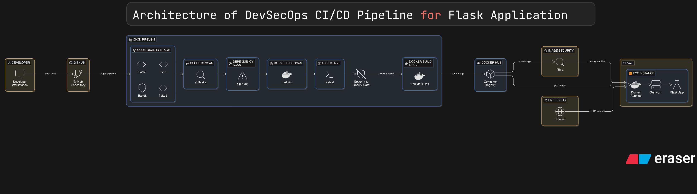
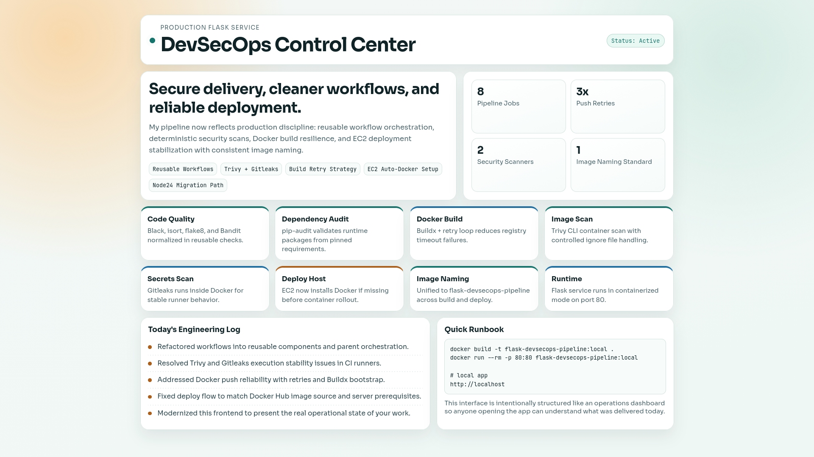
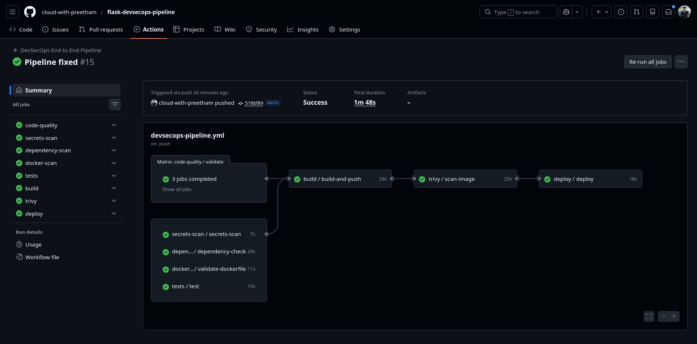

# Flask DevSecOps Pipeline

[](https://github.com/cloud-with-preetham/flask-devsecops-pipeline/actions/workflows/devsecops-pipeline.yml)
[](https://hub.docker.com/r/h4kops/flask-devsecops-pipeline)
[](LICENSE)
[](https://www.python.org/)

Flask application with an end-to-end DevSecOps pipeline using reusable GitHub Actions workflows, Docker image security checks, and EC2 deployment automation.

## Table of Contents

1. [Highlights](#highlights)
2. [Prerequisites](#prerequisites)
3. [Tech Stack](#tech-stack)
4. [Architecture](#architecture)
5. [Project Structure](#project-structure)
6. [Pipeline Gates](#pipeline-gates)
7. [Secrets and Variables](#secrets-and-variables)
8. [Application Routes](#application-routes)
9. [Run Locally](#run-locally)
10. [Deployment Runbook](#deployment-runbook)
11. [Troubleshooting](#troubleshooting)
12. [Versioning Strategy](#versioning-strategy)
13. [Contributing](#contributing)
14. [Screenshots](#screenshots)
15. [What I Learned Today](#what-i-learned-today)
16. [Roadmap](#roadmap)

## Highlights

- Flask app serving a modern UI template (`templates/index.html`)
- Dockerized runtime based on `python:3.10-slim`
- Reusable workflow-based CI/CD design
- Security automation across code, dependencies, and image layers
- Docker image build and push with retry logic
- Automated deployment to EC2 over SSH

## Prerequisites

- Docker 24+
- Docker Compose v2
- Python 3.12+ (for local non-container run)

## Tech Stack

- Python 3.12+ (CI), Python 3.10 (container runtime)
- Flask
- Docker / Docker Compose
- GitHub Actions
- Trivy, Gitleaks, pip-audit, Bandit, Hadolint

## Architecture

### Architecture Diagram



## Project Structure

```text
.
├── app.py
├── Dockerfile
├── docker-compose.yml
├── docs/
│   ├── architecture.md
│   └── architecture-diagram.html
├── requirements.txt
├── requirements-dev.txt
├── templates/
│   └── index.html
├── screenshots/
│   ├── architecture.png
│   ├── dashboard.png
│   ├── workflow.png
│   └── ...
└── .github/workflows/
    ├── devsecops-pipeline.yml
    ├── code-quality.yml
    ├── dependency-scan.yml
    ├── docker-scan.yml
    ├── secrets-scan.yml
    ├── tests.yml
    ├── build-and-push.yml
    ├── image-scan.yml
    └── deploy-to-server.yml
```

## Pipeline Gates

Parent workflow: `.github/workflows/devsecops-pipeline.yml`

| Order | Job               | Workflow File          | Purpose                            |
| ----- | ----------------- | ---------------------- | ---------------------------------- |
| 1     | `code-quality`    | `code-quality.yml`     | Black, isort, flake8, Bandit       |
| 2     | `secrets-scan`    | `secrets-scan.yml`     | Gitleaks secret detection          |
| 3     | `dependency-scan` | `dependency-scan.yml`  | `pip-audit` on Python dependencies |
| 4     | `docker-scan`     | `docker-scan.yml`      | Hadolint on Dockerfile             |
| 5     | `tests`           | `tests.yml`            | Pytest validation                  |
| 6     | `build`           | `build-and-push.yml`   | Buildx build and Docker Hub push   |
| 7     | `trivy`           | `image-scan.yml`       | Trivy image vulnerability scan     |
| 8     | `deploy`          | `deploy-to-server.yml` | Pull and run image on EC2          |

Deployment runs only after all prior jobs succeed.

## Secrets and Variables

| Name              | Type   | Used In       | Purpose                                |
| ----------------- | ------ | ------------- | -------------------------------------- |
| `DOCKERHUB_USER`  | Secret | build, deploy | Docker Hub username and repo namespace |
| `DOCKERHUB_TOKEN` | Secret | build, deploy | Docker Hub token for login/push/pull   |
| `EC2_HOST`        | Secret | deploy        | EC2 public host/IP                     |
| `EC2_USER`        | Secret | deploy        | SSH user on EC2                        |
| `EC2_SSH_KEY`     | Secret | deploy        | Private SSH key for server access      |

## Application Routes

| Method | Route | Description                  |
| ------ | ----- | ---------------------------- |
| `GET`  | `/`   | Serves the main dashboard UI |

## Run Locally

### Option 1: Docker Compose (recommended)

```bash
docker compose up --build
```

App URL: `http://localhost`

### Option 2: Python virtualenv

```bash
python3 -m venv .venv
source .venv/bin/activate
pip install -r requirements-dev.txt
python app.py
```

Note: app binds to port `80`.

### Stop Local Stack

```bash
docker compose down
```

### Tests and Quality Checks

```bash
pytest -q
black --check --workers 1 app.py test_app.py
isort --check-only app.py test_app.py
flake8 --jobs=1 app.py test_app.py
bandit -q -r app.py
pip-audit -r requirements.txt --strict
```

## Deployment Runbook

### Standard Deployment (automated by workflow)

1. Push changes to `main`.
2. Wait for `devsecops-pipeline.yml` to complete.
3. Verify the `deploy` job status in Actions.

### Manual Server Verification

```bash
docker ps
docker logs --tail 100 flask-devsecops-pipeline
curl -I http://localhost
```

### Rollback to Previous Image Tag

```bash
docker pull <dockerhub-user>/flask-devsecops-pipeline:<previous_sha>
docker stop flask-devsecops-pipeline || true
docker rm flask-devsecops-pipeline || true
docker run -d --name flask-devsecops-pipeline --restart unless-stopped -p 80:80 <dockerhub-user>/flask-devsecops-pipeline:<previous_sha>
```

## Troubleshooting

| Issue                               | Likely Cause                     | Fix                                                        |
| ----------------------------------- | -------------------------------- | ---------------------------------------------------------- |
| `ssh.ParsePrivateKey: no key found` | Invalid/empty SSH key secret     | Re-add full private key in `EC2_SSH_KEY`                   |
| `docker: command not found` on EC2  | Docker missing on server         | Deploy step now installs Docker; verify `sudo` privileges  |
| Docker push `504 Gateway Time-out`  | Registry/network transient issue | Retry build; workflow includes retry loop                  |
| `trivyignore` invalid input         | Action input mismatch            | Current workflow uses Trivy Docker CLI with `--ignorefile` |
| `gitleaks: command not found`       | Binary install path issue        | Current workflow runs Gitleaks via Docker image            |
| Node 20 deprecation warnings        | Legacy Node-based actions        | Use updated action versions or CLI/docker alternatives     |

## Versioning Strategy

Build workflow pushes three tags to Docker Hub:

- `flask-devsecops-pipeline:latest`
- `flask-devsecops-pipeline:main` (from branch name)
- `flask-devsecops-pipeline:<git_sha>`

Recommended usage:

- Use `latest` for default deployment.
- Use `git_sha` tags for traceable rollbacks.

## Contributing

1. Create a branch from `main` (example: `feature/readme-improvements`).
2. Keep commits focused and descriptive.
3. Run local checks before pushing:
   - `pytest -q`
   - `black --check --workers 1 app.py test_app.py`
   - `isort --check-only app.py test_app.py`
   - `flake8 --jobs=1 app.py test_app.py`
4. Open a pull request with:
   - change summary
   - screenshots (if UI changes)
   - notes about workflow or infra impact

## Screenshots

### Application UI



### GitHub Actions Workflow



## What I Learned Today

1. Reusable GitHub Actions workflows make CI/CD pipelines cleaner and easier to maintain.
2. End-to-end consistency matters: image name, registry, tags, and deploy target must match across workflows.
3. Security automation is strongest when layered across source, dependencies, and container images.
4. CI reliability improves with practical hardening such as build retries and explicit Buildx setup.
5. Deployment scripts should enforce prerequisites (like Docker availability) instead of assuming host state.
6. Runtime/tooling deprecations (Node20 to Node24) need proactive updates to avoid future pipeline breaks.
7. Good documentation plus visuals significantly improves maintainability and onboarding.

## Roadmap

1. Add `/health` route and include health checks in deployment verification.
2. Add environment-specific workflows (`dev`, `staging`, `prod`) with promotion gates.
3. Add IaC (Terraform/Ansible) for reproducible EC2 provisioning.
4. Add observability stack (metrics, logs, alerts).
5. Publish release notes/changelog per deployment.
